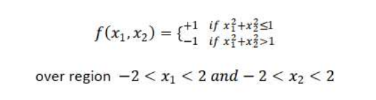

# Radial_Basis_Function

Write a Python Code that creates an RBF Network to approximate the mapping defined by:

As a training set, use 441 randomly sampled data points defined as
x = xi,xj
Where
xi = −2 + 0.2 i       i = 0,1, ... ,20
xj = −2 + 0.2 j        j = 0,1, ... ,20
1. Carry out the design of RBF NN based on Gaussian kernel functions with constant spread function and using all
the points in the training set as centers of the RB functions. Compare the performance results.
2. Perform the design of the RBF NN, using this time only 150 centers, choosing the centers using two approaches:
a) Randomly select the centers from the input data.
b) Use K-Means algorithm to find the centers. 
